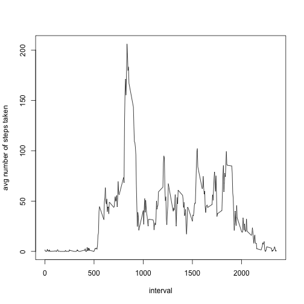

__Loading and preprocessing the data__

```r
setwd("/Users/gabnadal/Desktop")
activity <- read.csv("activity.csv")
steps <- activity$steps[complete.cases(activity$steps)]
```

__What is mean total number of steps taken per day?__

1. Calculate the total number of steps taken per day

```r
mean(steps)
```

```
## [1] 37.3826
```
2. If you do not understand the difference between a histogram and a barplot, research the difference between them. Make a histogram of the total number of steps taken each day

```r
hist(steps)
```

 

3. Calculate and report the mean and median of the total number of steps taken per day

```r
mean(steps)
```

```
## [1] 37.3826
```

```r
median(steps)
```

```
## [1] 0
```

__What is the average daily activity pattern?__

1. Make a time series plot (i.e. type = "l") of the 5-minute interval (x-axis) and the average number of steps taken, averaged across all days (y-axis)

```r
comp.act <- activity[complete.cases(activity),]
ints <- c(seq(0,55,by=5),seq(100,155,by=5),seq(200,255,by=5),seq(300,355,by=5),seq(400,455,by=5),seq(500,555,by=5),seq(600,655,by=5),seq(700,755,by=5),seq(800,855,by=5),seq(900,955,by=5),seq(1000,1055,by=5),seq(1100,1155,by=5),seq(1200,1255,by=5),seq(1300,1355,by=5),seq(1400,1455,by=5),seq(1500,1555,by=5),seq(1600,1655,by=5),seq(1700,1755,by=5),seq(1800,1855,by=5),seq(1900,1955,by=5),seq(2000,2055,by=5),seq(2100,2155,by=5),seq(2200,2255,by=5),seq(2300,2355,by=5))
intervs <- function(x){
    int.x = comp.act[comp.act$interval == x,]
    return(mean(int.x$steps))
}
avg.steps <- sapply(ints,intervs)
plot(ints,avg.steps, type="l",xlab="interval",ylab="avg number of steps taken")
```

 

2. Which 5-minute interval, on average across all the days in the dataset, contains the maximum number of steps?

```r
ints[avg.steps[max(avg.steps)]]
```

```
## [1] 435
```

__Imputing missing values__

1. Calculate and report the total number of missing values in the dataset (i.e. the total number of rows with NAs)

```r
sum(is.na(activity$steps))
```

```
## [1] 2304
```

2. Devise a strategy for filling in all of the missing values in the dataset. The strategy does not need to be sophisticated. For example, you could use the mean/median for that day, or the mean for that 5-minute interval, etc.
3. Create a new dataset that is equal to the original dataset but with the missing data filled in.

```r
activity1 <- activity
activity1[is.na(activity1)] <- 0
```

4. Make a histogram of the total number of steps taken each day and Calculate and report the mean and median total number of steps taken per day. Do these values differ from the estimates from the first part of the assignment? What is the impact of imputing missing data on the estimates of the total daily number of steps?

```r
steps1 <- activity1$steps
hist(steps1)
```

 

```r
mean(steps1)
```

```
## [1] 32.47996
```

```r
median(steps1)
```

```
## [1] 0
```

```r
## Based on my strategy, there is a change in the mean but not the median
```

